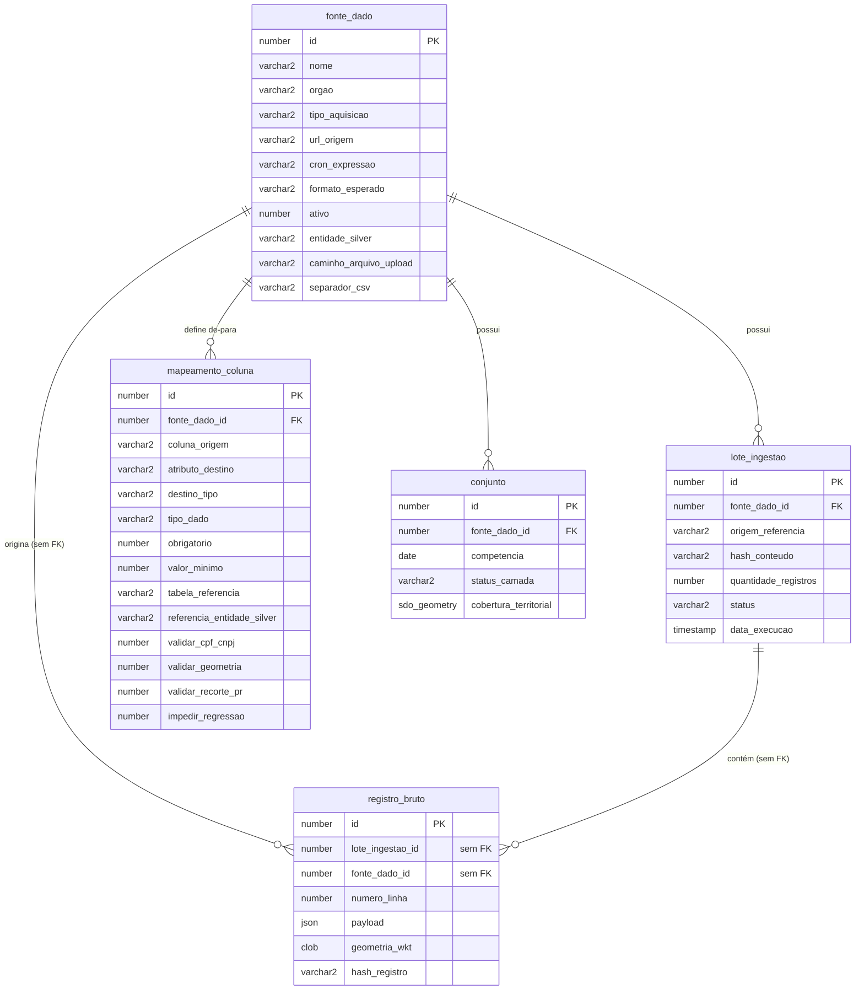
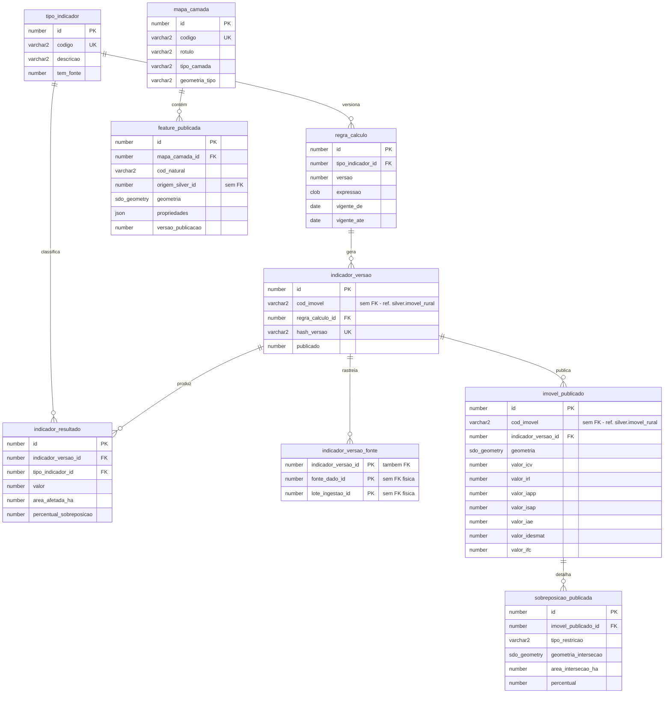

# Dicionário de Dados Interno — DataGis

> Documentação completa da estrutura do banco de dados relacional (Oracle Database,
> com Oracle Spatial) da aplicação DataGis: schemas, tabelas, tipos de dados e
> restrições. Extraído diretamente das migrations Flyway aplicadas
> (`src/main/resources/db/migration/**`, branch `sprint-1`, até `V035`) — não é uma
> aproximação, cada tipo/restrição abaixo bate com o DDL real.

---

## Sumário

1. [Schema `CONTROLE`](#1-schema-controle) — cadastro de fontes, execuções, de-para, conjuntos
2. [Schema `BRONZE`](#2-schema-bronze) — dado bruto, schema-on-read
3. [Schema `SILVER`](#3-schema-silver) — entidades canônicas tratadas (16 tabelas de referência + 8 de fato + 1 view)
4. [Schema `QUARENTENA`](#4-schema-quarentena) — registros reprovados, espelhos frouxos
5. [Schema `GOLD`](#5-schema-gold) — indicadores, camadas de mapa, detalhe publicado
6. [Schema `QUARTZ`](#6-schema-quartz) — agendamento (framework, DDL padrão Quartz)
7. [Convenções gerais](#7-convenções-gerais)
8. [Modelo Lógico Relacional (Mermaid)](#8-modelo-lógico-relacional-mermaid)

---

## 1. Schema `CONTROLE`

Schema transversal do projeto: cadastro de fontes de dados, histórico de execuções de
ingestão, de-para configurável Bronze→Silver e conjuntos de dados por competência. É o
único schema em que o usuário de aplicação (`APP_USER`) tem privilégios amplos
(`CREATE/ALTER/DROP ANY TABLE` etc.) para gerenciar os demais schemas via Flyway.

### 1.1. Tabela `fonte_dado`

Catálogo de todas as fontes de dados externas que o sistema conhece (CAR, IBAMA, IBGE,
ICMBio, FUNAI, INPE etc.). Uma linha por fonte cadastrada, com tudo que a ingestão
genérica por formato precisa pra buscar e converter os dados sem código novo.

| Atributo | Tipo de Dado | Restrição / Chave | Descrição |
| :--- | :--- | :--- | :--- |
| `id` | NUMBER | PK, Identity | Chave primária. |
| `nome` | VARCHAR2(200) | NOT NULL | Nome de exibição da fonte (ex.: "CAR - Imóveis (PR)"). |
| `orgao` | VARCHAR2(200) | NULL | Órgão responsável pela fonte (ex.: "SFB/SICAR"). |
| `tipo_aquisicao` | VARCHAR2(20) | NOT NULL | Como o dado é obtido: `UPLOAD_MANUAL` \| `API_REST` \| `DOWNLOAD_URL`. |
| `url_origem` | VARCHAR2(2000) | NULL | URL final de consulta, já com todo filtro resolvido (`CQL_FILTER`, `outSR`, `bbox` etc.). Nula para fontes `UPLOAD_MANUAL`. |
| `cron_expressao` | VARCHAR2(100) | NULL | Expressão cron para agendamento automático via Quartz. |
| `formato_esperado` | VARCHAR2(30) | NULL | Formato do dado de origem: `CSV` \| `GEOJSON` \| `SHAPEFILE` \| `JSON`. |
| `ativo` | NUMBER(1) | DEFAULT 1, NOT NULL | Fonte habilitada para execução (0/1, mapeado em Java com `NumericBooleanConverter`). |
| `ultima_execucao_em` | TIMESTAMP | NULL | Data/hora da última execução de ingestão. |
| `proxima_execucao_em` | TIMESTAMP | NULL | Próxima execução prevista (agendamento). |
| `data_add` | TIMESTAMP | DEFAULT SYSTIMESTAMP, NOT NULL | Data de cadastro da fonte. |
| `campo_geometria_lat` | VARCHAR2(100) | NULL | Nome do campo de latitude, só para fontes CSV com coordenada (ex.: focos de calor). |
| `campo_geometria_lon` | VARCHAR2(100) | NULL | Nome do campo de longitude, mesmo caso acima. |
| `entidade_silver` | VARCHAR2(40) | NULL | Entidade canônica da Silver de destino: `IMOVEL_RURAL` \| `AREA_PROTEGIDA` \| `EMBARGO_AMBIENTAL` \| `AUTO_INFRACAO` \| `DESMATAMENTO` \| `FOCO_CALOR` \| `MUNICIPIO`. Nula enquanto a fonte só tiver Bronze. |
| `caminho_arquivo_upload` | VARCHAR2(500) | NULL | Endereço (devolvido por `ArmazenamentoArquivoBruto`) do último arquivo enviado, para fontes `UPLOAD_MANUAL`. |
| `ultima_duracao_ms` | NUMBER | NULL | Duração da última execução, em milissegundos. |
| `ultimo_status_execucao` | VARCHAR2(20) | NULL | `SUCESSO` \| `ERRO` (nulo = nunca executou). |
| `ultimo_erro_mensagem` | VARCHAR2(2000) | NULL | Mensagem de erro, só preenchida se `ultimo_status_execucao = ERRO`. |
| `separador_csv` | VARCHAR2(5) | DEFAULT ',', NOT NULL | Caractere separador de campo para fontes CSV (`,`, `;`, `\|` etc. — variam entre provedores). |

**Grants relacionados:** `GRANT REFERENCES ON fonte_dado TO bronze` (necessário pois FK
cross-schema não é coberta por `CREATE ANY TABLE` — ver CLAUDE.md §2.1).

### 1.2. Tabela `lote_ingestao`

Registra cada execução de ingestão (um "lote" por chamada/upload), com o hash do
conteúdo recebido para detectar "fonte não mudou desde a última vez".

| Atributo | Tipo de Dado | Restrição / Chave | Descrição |
| :--- | :--- | :--- | :--- |
| `id` | NUMBER | PK, Identity | Chave primária. |
| `fonte_dado_id` | NUMBER | NOT NULL, FK `fonte_dado(id)` | Fonte que originou o lote. |
| `origem_referencia` | VARCHAR2(1000) | NULL | URL da API chamada, ou nome do arquivo do upload. |
| `hash_conteudo` | VARCHAR2(64) | NULL | Hash SHA-256 do conteúdo relevante recebido (não do envelope inteiro — evita falso positivo de "mudou" por campo de timestamp da resposta). |
| `quantidade_registros` | NUMBER | NULL | Quantidade de registros brutos gravados neste lote. |
| `status` | VARCHAR2(30) | DEFAULT 'CONCLUIDO', NOT NULL | `EM_PROCESSAMENTO` \| `CONCLUIDO` \| `SEM_MUDANCA` \| `PROMOVIDO_SILVER` \| `RETIDO_QUARENTENA` \| `DESCARTADO`. |
| `data_execucao` | TIMESTAMP | DEFAULT SYSTIMESTAMP, NOT NULL | Data/hora do disparo da execução. |

**Grants relacionados:** `GRANT REFERENCES ON lote_ingestao TO bronze` (mesmo motivo do
`fonte_dado`).

### 1.3. Tabela `mapeamento_coluna`

De-para configurável campo a campo: qual coluna do payload bruto (Bronze) vira qual
atributo canônico da Silver, e quais regras de validação se aplicam a esse campo. É a
tabela que o motor de validação (`OrquestradorValidacao`) lê em runtime — cadastrar uma
fonte nova (mesmo tema) não exige migration nova, só linhas aqui.

| Atributo | Tipo de Dado | Restrição / Chave | Descrição |
| :--- | :--- | :--- | :--- |
| `id` | NUMBER | PK, Identity | Chave primária. |
| `fonte_dado_id` | NUMBER | NOT NULL, FK `fonte_dado(id)` | Fonte a que este mapeamento pertence. |
| `coluna_origem` | VARCHAR2(200) | NOT NULL | Chave no payload JSON do Bronze (ex.: `num_tad`). |
| `atributo_destino` | VARCHAR2(100) | NOT NULL | Coluna canônica de destino na Silver (ex.: `numero_termo`). |
| `destino_tipo` | VARCHAR2(20) | NOT NULL, CHECK IN ('COLUNA','JSON','GEOMETRIA') | Tipo de destino do valor transformado. |
| `tipo_dado` | VARCHAR2(30) | NULL | Como interpretar o valor de origem: `texto` \| `numero` \| `data_iso` \| `epoch_millis` \| `cpf_cnpj` \| `graus2_para_ha` \| `wkt` etc. |
| `obrigatorio` | NUMBER(1) | DEFAULT 0, NOT NULL | Se 1, ausência/nulo do campo gera erro `CAMPO_OBRIGATORIO_AUSENTE`. |
| `valor_minimo` | NUMBER | NULL | Limite numérico inferior (ex.: `area_ha > 0`). Sem teto máximo. |
| `tabela_referencia` | VARCHAR2(60) | NULL | Tabela de referência da Silver para validação de domínio (ex.: `situacao_imovel`, `orgao`, `bioma`). |
| `referencia_entidade_silver` | VARCHAR2(60) | NULL | Entidade Silver para validação de integridade cruzada (ex.: `municipio`, para `cod_municipio_ibge`). |
| `validar_cpf_cnpj` | NUMBER(1) | DEFAULT 0, NOT NULL, CHECK IN (0,1) | Ativa validação algorítmica de CPF/CNPJ (módulo 11). |
| `validar_geometria` | NUMBER(1) | DEFAULT 0, NOT NULL, CHECK IN (0,1) | Ativa validação topológica (`IsValidOp`) e de tipo primitivo. |
| `validar_recorte_pr` | NUMBER(1) | DEFAULT 0, NOT NULL, CHECK IN (0,1) | Ativa checagem de coordenadas/polígono dentro dos limites do Paraná. |
| `impedir_regressao` | NUMBER(1) | DEFAULT 1, NOT NULL, CHECK IN (0,1) | Impede que um campo antes preenchido volte a `null` num lote mais novo. |
| `regras_extras` | JSON | NULL | Regras customizadas de fontes futuras que não justificam coluna DDL nova. |
| `data_add` | TIMESTAMP | DEFAULT SYSTIMESTAMP, NOT NULL | Data de cadastro do mapeamento. |

**Restrições adicionais:**
* `UNIQUE KEY uq_mapeamento_coluna (fonte_dado_id, coluna_origem, atributo_destino)` — evita mapear a mesma coluna de origem para o mesmo destino mais de uma vez, na mesma fonte.
* `CHECK ck_mapeamento_destino_tipo (destino_tipo IN ('COLUNA', 'JSON', 'GEOMETRIA'))`.
* Índice `ix_mapeamento_coluna_fonte (fonte_dado_id)`.

### 1.4. Tabela `conjunto`

Associa uma fonte de dado a uma competência (período de referência) e um status de
camada, com cobertura territorial opcional. Peça mais recente do modelo (`LIZARDS-8`) —
ainda não conectada ao pipeline real de transição Bronze→Silver (o `status_camada` é
informado no cadastro, não atualizado automaticamente pela execução do lote).

| Atributo | Tipo de Dado | Restrição / Chave | Descrição |
| :--- | :--- | :--- | :--- |
| `id` | NUMBER(19,0) | PK, Identity | Chave primária. |
| `fonte_dado_id` | NUMBER(19,0) | NOT NULL, FK `fonte_dado(id)` | Fonte associada ao conjunto. |
| `competencia` | DATE | NOT NULL | Período de referência do conjunto de dados. |
| `status_camada` | VARCHAR2(50) | NOT NULL | `ATIVA` \| `INATIVA` \| `PROCESSANDO` \| `ERRO`. |
| `cobertura_territorial` | MDSYS.SDO_GEOMETRY | NULL | Geometria opcional de cobertura territorial do conjunto (SRID 4674). |

---

## 2. Schema `BRONZE`

Zona bruta: dado exatamente como recebido da fonte, sem tratamento nenhum. Desenho
**schema-on-read** — uma única tabela genérica guarda qualquer formato de origem como
JSON, em vez de uma tabela por fonte.

### 2.1. Tabela `registro_bruto`

| Atributo | Tipo de Dado | Restrição / Chave | Descrição |
| :--- | :--- | :--- | :--- |
| `id` | NUMBER | PK, Identity | Chave primária. |
| `lote_ingestao_id` | NUMBER | NOT NULL, referencia `controle.lote_ingestao(id)` (cross-schema, sem FK física) | Lote a que este registro pertence. |
| `fonte_dado_id` | NUMBER | NOT NULL, referencia `controle.fonte_dado(id)` (cross-schema, sem FK física) | Fonte de origem do registro. |
| `numero_linha` | NUMBER | NULL | Posição do registro no arquivo/resposta original (rastreabilidade). |
| `payload` | JSON | NOT NULL | O registro inteiro, com os nomes de coluna originais da fonte — sem tipagem, sem interpretação. |
| `geometria_wkt` | CLOB | NULL | Geometria em WKT, convertida mas **sem validar** nesta camada. |
| `hash_registro` | VARCHAR2(64) | NULL | Hash para ajudar a localizar duplicata depois. |
| `data_ingestao` | TIMESTAMP | DEFAULT SYSTIMESTAMP, NOT NULL | Data/hora de gravação do registro. |

---

## 3. Schema `SILVER`

Entidades canônicas de domínio, organizadas **por fenômeno, não por fonte** — um
embargo do IBAMA e um embargo do ICMBio caem na mesma tabela `embargo_ambiental`. Todo
domínio de negócio ("enum") é FK para uma tabela de referência semeada. Núcleo tipado +
`atributos_origem JSON` para o que é específico da fonte. Geometria em
`MDSYS.SDO_GEOMETRY` (SRID 4674, registrado na migration `V013`). Toda tabela de fato
carrega o bloco de linhagem (`fonte_dado_id`/`lote_ingestao_id`/`registro_bruto_id`,
cross-schema, sem FK física — mesmo princípio do Bronze) + `hash_origem`. **Silver é
current-state** (upsert via `MERGE`), não versionamento histórico (SCD).

### 3.1. Tabelas de referência

Todas seguem o mesmo padrão estrutural: `id IDENTITY PK`, `codigo UNIQUE`, `descricao`,
`ativo`, `data_add`. Nasceram semeadas com o domínio conhecido + o que apareceu nos
dados reais das fontes já ingeridas.

| # | Tabela | Domínio coberto | Valores semeados (`codigo`) |
| :-- | :--- | :--- | :--- |
| 3.1.1 | `orgao` | Órgãos emissores/fiscalizadores | `SFB_SICAR`, `IBAMA`, `ICMBIO`, `FUNAI`, `INCRA`, `IBGE`, `INPE`, `IAT_PR` |
| 3.1.2 | `bioma` | Biomas brasileiros | `MATA_ATLANTICA`, `CERRADO`, `CAATINGA`, `AMAZONIA`, `PAMPA`, `PANTANAL` |
| 3.1.3 | `satelite` | Satélites de sensoriamento remoto (desmatamento/foco de calor) | `AQUA_M-T`, `TERRA_M-M`, `GOES-16`, `NOAA-20`, `NPP-375`, `LANDSAT7`, `LANDSAT8` |
| 3.1.4 | `sensor` | Sensores associados aos satélites | `ETM`, `TM`, `OLI`, `MODIS`, `VIIRS` |
| 3.1.5 | `unidade_federativa` | Unidades da Federação — **única com colunas extras**: `cod_ibge NUMBER(2) UNIQUE`, `regiao VARCHAR2(20)` | 27 UFs, com sigla, nome, código IBGE e região |
| 3.1.6 | `situacao_imovel` | Situação do imóvel rural (CAR) | `AT` (Ativo), `PE` (Pendente), `SU` (Suspenso), `CA` (Cancelado) |
| 3.1.7 | `condicao_imovel` | Condição de análise do CAR | `AGUARDANDO_ANALISE`, `EM_ANALISE`, `ANALISADO_SEM_PENDENCIAS`, `ANALISADO_COM_PENDENCIAS`, `CANCELADO_ADM`, `CANCELADO_JUDICIAL` |
| 3.1.8 | `tipo_imovel` | Tipo de imóvel do CAR | `IRU` (Imóvel Rural), `AST` (Assentamento), `PCT` (Território de Povos e Comunidades Tradicionais) |
| 3.1.9 | `tipo_area_protegida` | Tipo de área protegida/território especial | `UC_PROTECAO_INTEGRAL`, `UC_USO_SUSTENTAVEL`, `TERRA_INDIGENA`, `TERRITORIO_QUILOMBOLA`, `ASSENTAMENTO_INCRA` |
| 3.1.10 | `categoria_area_protegida` | Categoria dentro do tipo — **tem FK própria**: `tipo_area_protegida_id NOT NULL` | `PARNA`, `REBIO`, `ESEC`, `REVIS`, `MONA` (proteção integral); `FLONA`, `RESEX`, `RDS`, `ARIE`, `APA`, `RPPN` (uso sustentável); `TI_TRADICIONALMENTE_OCUPADA`, `TI_RESERVA_INDIGENA`, `TI_DOMINIAL`, `TI_INTERDITADA` (terra indígena) |
| 3.1.11 | `tipo_area_embargo` | Motivo do embargo ambiental | `DESMATAMENTO`, `QUEIMADA`, `EXPLORACAO_IRREGULAR`, `OUTROS` |
| 3.1.12 | `tipo_auto_infracao` | Tipo de sanção do auto de infração | `MULTA_SIMPLES`, `MULTA_DIARIA`, `ADVERTENCIA`, `APREENSAO`, `EMBARGO`, `DEMOLICAO`, `SUSPENSAO` |
| 3.1.13 | `tipo_infracao` | Categoria legal da infração | `CONTRA_FLORA`, `CONTRA_FAUNA`, `POLUICAO`, `CONTRA_ADMIN_AMBIENTAL`, `EM_UNIDADES_CONSERVACAO`, `CONTRA_ORDENAMENTO_URBANO` |
| 3.1.14 | `tipo_pessoa` | Tipo de pessoa do infrator — `codigo VARCHAR2(2)` | `PF` (Física), `PJ` (Jurídica) |
| 3.1.15 | `status_auto_infracao` | Status processual do auto | `LAVRADO`, `HOMOLOGADO`, `JULGADO`, `CANCELADO` |
| 3.1.16 | `classe_prodes` | Classe de uso/cobertura do PRODES | `DESMATAMENTO`, `NAO_FLORESTA`, `NUVEM`, `HIDROGRAFIA`, `FLORESTA` |

### 3.2. Tabela `municipio`

Dimensão/hub de join — fonte: IBGE Malha Municipal.

| Atributo | Tipo de Dado | Restrição / Chave | Descrição |
| :--- | :--- | :--- | :--- |
| `id` | NUMBER | PK, Identity | Chave primária. |
| `cod_ibge` | NUMBER(7) | NOT NULL, UNIQUE | Código IBGE do município. |
| `nome` | VARCHAR2(120) | NOT NULL | Nome do município. |
| `unidade_federativa_id` | NUMBER | NOT NULL, FK `unidade_federativa(id)` | UF do município. |
| `bioma_predominante_id` | NUMBER | FK `bioma(id)` | Bioma predominante no município. |
| `area_km2` | NUMBER | NULL | Área territorial em km². |
| `geometria` | MDSYS.SDO_GEOMETRY | NULL | Polígono do município (SRID 4674). |
| `atributos_origem` | JSON | NULL | Atributos específicos da fonte, não canônicos. |
| `fonte_dado_id` | NUMBER | NOT NULL (cross-schema, sem FK) | Linhagem: fonte de origem. |
| `lote_ingestao_id` | NUMBER | NOT NULL (cross-schema, sem FK) | Linhagem: lote de origem. |
| `registro_bruto_id` | NUMBER | NOT NULL (cross-schema, sem FK) | Linhagem: registro bruto de origem. |
| `data_competencia` | DATE | NULL | Data de referência do dado. |
| `data_processamento` | TIMESTAMP | DEFAULT SYSTIMESTAMP, NOT NULL | Data da promoção pra Silver. |
| `hash_origem` | VARCHAR2(64) | NULL | Hash do registro bruto de origem. |

### 3.3. Tabela `imovel_rural`

Entidade central da Silver — todo indicador socioambiental é "sobre um imóvel". Fonte:
CAR (SICAR).

| Atributo | Tipo de Dado | Restrição / Chave | Descrição |
| :--- | :--- | :--- | :--- |
| `id` | NUMBER | PK, Identity | Chave primária. |
| `cod_imovel` | VARCHAR2(80) | NOT NULL, UNIQUE | Chave natural do CAR (ex.: `PR-4106902-00B2EA81...`). |
| `situacao_imovel_id` | NUMBER | FK `situacao_imovel(id)` | Situação do imóvel (AT/PE/SU/CA). |
| `condicao_imovel_id` | NUMBER | FK `condicao_imovel(id)` | Condição de análise no CAR. |
| `tipo_imovel_id` | NUMBER | FK `tipo_imovel(id)` | Tipo de imóvel. |
| `municipio_id` | NUMBER | FK `municipio(id)` | Município onde o imóvel está localizado. |
| `data_registro` | DATE | NULL | Data de registro no CAR. |
| `area_ha` | NUMBER | NULL | Área do imóvel, em hectares. |
| `modulos_fiscais` | NUMBER | NULL | Área do imóvel em módulos fiscais. |
| `geometria` | MDSYS.SDO_GEOMETRY | NULL | Perímetro do imóvel (SRID 4674). |
| `atributos_origem` | JSON | NULL | Atributos específicos da fonte. |
| `fonte_dado_id` | NUMBER | NOT NULL (cross-schema, sem FK) | Linhagem. |
| `lote_ingestao_id` | NUMBER | NOT NULL (cross-schema, sem FK) | Linhagem. |
| `registro_bruto_id` | NUMBER | NOT NULL (cross-schema, sem FK) | Linhagem. |
| `data_competencia` | DATE | NULL | Data de referência do dado. |
| `data_processamento` | TIMESTAMP | DEFAULT SYSTIMESTAMP, NOT NULL | Data da promoção pra Silver. |
| `hash_origem` | VARCHAR2(64) | NULL | Hash do registro bruto de origem. |

Índice: `ix_imovel_rural_municipio (municipio_id)`.

### 3.4. Tabela `area_protegida`

Alimenta o indicador **ISAP**. Fontes: ICMBio (UCs), FUNAI (TIs), futuramente INCRA.

| Atributo | Tipo de Dado | Restrição / Chave | Descrição |
| :--- | :--- | :--- | :--- |
| `id` | NUMBER | PK, Identity | Chave primária. |
| `codigo_origem` | VARCHAR2(80) | NOT NULL | Código na fonte: `cnuc` (UC) ou `terrai_cod` (TI). |
| `nome` | VARCHAR2(200) | NOT NULL | Nome da área protegida. |
| `tipo_area_protegida_id` | NUMBER | NOT NULL, FK `tipo_area_protegida(id)` | Tipo (UC proteção integral, UC uso sustentável, TI etc.). |
| `categoria_area_protegida_id` | NUMBER | FK `categoria_area_protegida(id)` | Categoria específica (PARNA, RESEX etc.). |
| `orgao_id` | NUMBER | NOT NULL, FK `orgao(id)` | Órgão gestor. |
| `bioma_id` | NUMBER | FK `bioma(id)` | Bioma predominante na área. |
| `ato_legal` | VARCHAR2(500) | NULL | Ato legal de criação. |
| `area_ha` | NUMBER | NULL | Área em hectares. |
| `geometria` | MDSYS.SDO_GEOMETRY | NULL | Polígono da área (SRID 4674). |
| `atributos_origem` | JSON | NULL | Atributos específicos da fonte. |
| `fonte_dado_id` | NUMBER | NOT NULL (cross-schema, sem FK) | Linhagem. |
| `lote_ingestao_id` | NUMBER | NOT NULL (cross-schema, sem FK) | Linhagem. |
| `registro_bruto_id` | NUMBER | NOT NULL (cross-schema, sem FK) | Linhagem. |
| `data_competencia` | DATE | NULL | Data de referência do dado. |
| `data_processamento` | TIMESTAMP | DEFAULT SYSTIMESTAMP, NOT NULL | Data da promoção pra Silver. |
| `hash_origem` | VARCHAR2(64) | NULL | Hash do registro bruto de origem. |

**Restrições adicionais:** `UNIQUE KEY uq_area_protegida_origem (codigo_origem, orgao_id)`.

### 3.5. Tabela `area_protegida_uf` (bridge N:N)

Uma UC/TI pode abranger mais de uma UF (ex.: "SP/PR" nos dados reais) — tabela ponte
sem coluna própria além da chave composta.

| Atributo | Tipo de Dado | Restrição / Chave | Descrição |
| :--- | :--- | :--- | :--- |
| `area_protegida_id` | NUMBER | PK (composta), FK `area_protegida(id)` | Área protegida. |
| `unidade_federativa_id` | NUMBER | PK (composta), FK `unidade_federativa(id)` | UF abrangida. |

### 3.6. Tabela `auto_infracao`

Contexto suplementar do indicador IAE. Fontes: IBAMA, ICMBio — IBAMA quase sempre vem
sem geometria (coluna nullable por isso).

| Atributo | Tipo de Dado | Restrição / Chave | Descrição |
| :--- | :--- | :--- | :--- |
| `id` | NUMBER | PK, Identity | Chave primária. |
| `numero_auto` | VARCHAR2(40) | NOT NULL | Número do auto de infração. |
| `orgao_id` | NUMBER | NOT NULL, FK `orgao(id)` | Órgão autuante. |
| `tipo_auto_infracao_id` | NUMBER | FK `tipo_auto_infracao(id)` | Tipo de sanção aplicada. |
| `tipo_infracao_id` | NUMBER | FK `tipo_infracao(id)` | Categoria legal da infração. |
| `tipo_pessoa_id` | NUMBER | FK `tipo_pessoa(id)` | PF ou PJ do infrator. |
| `status_auto_infracao_id` | NUMBER | FK `status_auto_infracao(id)` | Status processual. |
| `municipio_id` | NUMBER | FK `municipio(id)` | Município da ocorrência. |
| `cpf_cnpj_infrator` | VARCHAR2(20) | NULL | CPF/CNPJ do infrator. |
| `nome_infrator` | VARCHAR2(200) | NULL | Nome do infrator. |
| `data_auto` | DATE | NULL | Data de lavratura do auto. |
| `num_processo` | VARCHAR2(40) | NULL | Número do processo administrativo. |
| `valor_multa` | NUMBER | NULL | Valor da multa aplicada. |
| `houve_embargo` | NUMBER(1) | NULL | Se o auto gerou embargo associado. |
| `houve_apreensao` | NUMBER(1) | NULL | Se houve apreensão de bens/produtos. |
| `descricao` | CLOB | NULL | Descrição detalhada da infração. |
| `geometria` | MDSYS.SDO_GEOMETRY | NULL | Geometria da ocorrência, quando disponível (SRID 4674). |
| `atributos_origem` | JSON | NULL | Atributos específicos da fonte. |
| `fonte_dado_id` | NUMBER | NOT NULL (cross-schema, sem FK) | Linhagem. |
| `lote_ingestao_id` | NUMBER | NOT NULL (cross-schema, sem FK) | Linhagem. |
| `registro_bruto_id` | NUMBER | NOT NULL (cross-schema, sem FK) | Linhagem. |
| `data_competencia` | DATE | NULL | Data de referência do dado. |
| `data_processamento` | TIMESTAMP | DEFAULT SYSTIMESTAMP, NOT NULL | Data da promoção pra Silver. |
| `hash_origem` | VARCHAR2(64) | NULL | Hash do registro bruto de origem. |

**Restrições adicionais:** `UNIQUE KEY uq_auto_infracao_origem (numero_auto, orgao_id)`.
Índice: `ix_auto_infracao_municipio (municipio_id)`.

### 3.7. Tabela `embargo_ambiental`

Alimenta o indicador **IAE**. Fontes: IBAMA, ICMBio.

| Atributo | Tipo de Dado | Restrição / Chave | Descrição |
| :--- | :--- | :--- | :--- |
| `id` | NUMBER | PK, Identity | Chave primária. |
| `numero_termo` | VARCHAR2(60) | NOT NULL | Número do termo: `num_tad` (IBAMA) ou `numero_emb` (ICMBio). |
| `orgao_id` | NUMBER | NOT NULL, FK `orgao(id)` | Órgão que aplicou o embargo. |
| `auto_infracao_id` | NUMBER | FK `auto_infracao(id)` | Auto de infração de origem (embargo é consequência do auto). |
| `tipo_area_embargo_id` | NUMBER | FK `tipo_area_embargo(id)` | Motivo do embargo. |
| `municipio_id` | NUMBER | FK `municipio(id)` | Município da área embargada. |
| `cpf_cnpj` | VARCHAR2(20) | NULL | CPF/CNPJ do autuado. |
| `nome_autuado` | VARCHAR2(200) | NULL | Nome do autuado. |
| `data_embargo` | DATE | NULL | Data do embargo. |
| `num_processo` | VARCHAR2(40) | NULL | Número do processo administrativo. |
| `num_auto_infracao` | VARCHAR2(40) | NULL | Número do auto de infração relacionado (texto, além do FK acima). |
| `area_embargada_ha` | NUMBER | NULL | Área embargada, em hectares (direto do IBAMA; calculado da geometria no caso ICMBio). |
| `descricao` | CLOB | NULL | Descrição detalhada. |
| `geometria` | MDSYS.SDO_GEOMETRY | NULL | Polígono da área embargada (SRID 4674). |
| `atributos_origem` | JSON | NULL | Atributos específicos da fonte. |
| `fonte_dado_id` | NUMBER | NOT NULL (cross-schema, sem FK) | Linhagem. |
| `lote_ingestao_id` | NUMBER | NOT NULL (cross-schema, sem FK) | Linhagem. |
| `registro_bruto_id` | NUMBER | NOT NULL (cross-schema, sem FK) | Linhagem. |
| `data_competencia` | DATE | NULL | Data de referência do dado. |
| `data_processamento` | TIMESTAMP | DEFAULT SYSTIMESTAMP, NOT NULL | Data da promoção pra Silver. |
| `hash_origem` | VARCHAR2(64) | NULL | Hash do registro bruto de origem. |

**Restrições adicionais:** `UNIQUE KEY uq_embargo_ambiental_origem (numero_termo, orgao_id)`.
Índice: `ix_embargo_municipio (municipio_id)`.

### 3.8. Tabela `desmatamento`

Alimenta o indicador **IDesmat**. Fonte: INPE PRODES.

| Atributo | Tipo de Dado | Restrição / Chave | Descrição |
| :--- | :--- | :--- | :--- |
| `id` | NUMBER | PK, Identity | Chave primária. |
| `identificador_origem` | VARCHAR2(80) | NOT NULL | UUID/FID do PRODES. |
| `ano` | NUMBER(4) | NULL | Ano de referência da detecção. |
| `classe_prodes_id` | NUMBER | FK `classe_prodes(id)` | Classe de uso/cobertura detectada. |
| `satelite_id` | NUMBER | FK `satelite(id)` | Satélite usado na detecção. |
| `sensor_id` | NUMBER | FK `sensor(id)` | Sensor usado na detecção. |
| `area_ha` | NUMBER | NULL | Área desmatada, em hectares. |
| `data_imagem` | DATE | NULL | Data da imagem de satélite. |
| `geometria` | MDSYS.SDO_GEOMETRY | NULL | Polígono da área desmatada (SRID 4674). |
| `atributos_origem` | JSON | NULL | Atributos específicos da fonte. |
| `fonte_dado_id` | NUMBER | NOT NULL (cross-schema, sem FK) | Linhagem. |
| `lote_ingestao_id` | NUMBER | NOT NULL (cross-schema, sem FK) | Linhagem. |
| `registro_bruto_id` | NUMBER | NOT NULL (cross-schema, sem FK) | Linhagem. |
| `data_competencia` | DATE | NULL | Data de referência do dado. |
| `data_processamento` | TIMESTAMP | DEFAULT SYSTIMESTAMP, NOT NULL | Data da promoção pra Silver. |
| `hash_origem` | VARCHAR2(64) | NULL | Hash do registro bruto de origem. |

**Restrições adicionais:** `UNIQUE KEY uq_desmatamento_origem (fonte_dado_id, identificador_origem)`.

### 3.9. Tabela `foco_calor`

Alimenta o indicador **IFC**. Maior tabela em volume (~154 mil registros). Fontes:
IAT/PR, INPE Queimadas (CSV).

| Atributo | Tipo de Dado | Restrição / Chave | Descrição |
| :--- | :--- | :--- | :--- |
| `id` | NUMBER | PK, Identity | Chave primária. |
| `identificador_origem` | VARCHAR2(80) | NOT NULL | `id` (UUID, fonte IAT/PR) ou `objectid` (fonte INPE). |
| `data_hora` | TIMESTAMP | NULL | Data/hora da detecção do foco. |
| `satelite_id` | NUMBER | FK `satelite(id)` | Satélite de detecção. |
| `bioma_id` | NUMBER | FK `bioma(id)` | Bioma do foco. |
| `municipio_id` | NUMBER | FK `municipio(id)` | Município (só a fonte INPE traz código IBGE). |
| `latitude` | NUMBER | NULL | Latitude do foco. |
| `longitude` | NUMBER | NULL | Longitude do foco. |
| `risco_fogo` | NUMBER | NULL | Índice de risco de fogo. |
| `dias_sem_chuva` | NUMBER | NULL | Dias consecutivos sem chuva na região. |
| `precipitacao_mm` | NUMBER | NULL | Precipitação acumulada, em mm. |
| `frp` | NUMBER | NULL | Fire Radiative Power (potência radiativa do fogo). |
| `geometria` | MDSYS.SDO_GEOMETRY | NULL | Ponto do foco (SRID 4674). |
| `atributos_origem` | JSON | NULL | Atributos específicos da fonte. |
| `fonte_dado_id` | NUMBER | NOT NULL (cross-schema, sem FK) | Linhagem. |
| `lote_ingestao_id` | NUMBER | NOT NULL (cross-schema, sem FK) | Linhagem. |
| `registro_bruto_id` | NUMBER | NOT NULL (cross-schema, sem FK) | Linhagem. |
| `data_competencia` | DATE | NULL | Data de referência do dado. |
| `data_processamento` | TIMESTAMP | DEFAULT SYSTIMESTAMP, NOT NULL | Data da promoção pra Silver. |
| `hash_origem` | VARCHAR2(64) | NULL | Hash do registro bruto de origem. |

**Restrições adicionais:** `UNIQUE KEY uq_foco_calor_origem (fonte_dado_id, identificador_origem)`.
Índice: `ix_foco_calor_municipio (municipio_id)`.

### 3.10. View `vw_restricao_territorial`

Não é tabela — é uma **view** que unifica `area_protegida` + `embargo_ambiental` +
`desmatamento` num único conjunto, pensada para ser lida pelos futuros calculadores dos
indicadores ISAP/IAE/IDesmat (ver `docs/analise-fluxo-etl-2026-09-21.md`, seções 5-8).

| Coluna | Origem | Descrição |
| :--- | :--- | :--- |
| `origem_tabela` | literal | `'AREA_PROTEGIDA'` \| `'EMBARGO_AMBIENTAL'` \| `'DESMATAMENTO'` |
| `origem_id` | `id` da tabela de origem | Chave da linha na tabela de origem. |
| `tipo_restricao` | tipo da tabela de origem | Ex.: `TERRA_INDIGENA`, `EMBARGO`, `DESMATAMENTO`. |
| `subtipo_restricao` | categoria/órgão/classe da tabela de origem | Ex.: `PARNA`, `IBAMA`, classe PRODES. |
| `descricao` | nome/descrição da tabela de origem | Texto descritivo. |
| `geometria` | geometria da tabela de origem | `MDSYS.SDO_GEOMETRY`. |
| `area_ha` | área da tabela de origem | Área em hectares. |
| `data_competencia` | data de referência da tabela de origem | — |
| `fonte_dado_id` / `lote_ingestao_id` | linhagem da tabela de origem | — |

---

## 4. Schema `QUARENTENA`

Registros que falharam em alguma regra de validação Bronze→Silver. Um **espelho
frouxo** por tabela de fato da Silver — toda coluna de negócio é `NULL`-ável, sem
FK/UNIQUE/CHECK (o dado rejeitado pode ser exatamente o que quebrou a regra); colunas
que na Silver são `_id` FK aqui viram texto cru (guarda o valor original recebido);
geometria fica como CLOB de WKT cru. Correção é sempre manual, feita pelo Operador de
Dados (RN007).

### 4.1. Tabela `tipo_erro_quarentena`

Catálogo dos tipos de erro que podem levar um registro à quarentena.

| Atributo | Tipo de Dado | Restrição / Chave | Descrição |
| :--- | :--- | :--- | :--- |
| `id` | NUMBER | PK, Identity | Chave primária. |
| `codigo` | VARCHAR2(40) | NOT NULL, UNIQUE | Código do tipo de erro. |
| `descricao` | VARCHAR2(200) | NOT NULL | Descrição do tipo de erro. |
| `ativo` | NUMBER(1) | DEFAULT 1, NOT NULL | Se o tipo de erro está em uso. |
| `data_add` | TIMESTAMP | DEFAULT SYSTIMESTAMP, NOT NULL | Data de cadastro. |

Valores semeados (`codigo`): `GEOMETRIA_NULA`, `GEOMETRIA_INVALIDA`,
`GEOMETRIA_MALFORMADA`, `CAMPO_OBRIGATORIO_AUSENTE`, `TIPO_DE_DADO_INVALIDO`,
`VALOR_FORA_DO_DOMINIO`, `CHAVE_NATURAL_DUPLICADA`, `REFERENCIA_NAO_ENCONTRADA`,
`FORA_DO_RECORTE_TERRITORIAL`, `CPF_CNPJ_INVALIDO`, `VALOR_ABAIXO_DO_MINIMO`,
`CAMPO_EM_BRANCO`, `GEOMETRIA_TIPO_INCOMPATIVEL`, `REGRESSAO_DE_VALOR`.

### 4.2. Tabela `status_analise_quarentena`

Workflow de status de um item da quarentena.

| Atributo | Tipo de Dado | Restrição / Chave | Descrição |
| :--- | :--- | :--- | :--- |
| `id` | NUMBER | PK, Identity | Chave primária. |
| `codigo` | VARCHAR2(40) | NOT NULL, UNIQUE | Código do status. |
| `descricao` | VARCHAR2(200) | NOT NULL | Descrição do status. |
| `ativo` | NUMBER(1) | DEFAULT 1, NOT NULL | Se o status está em uso. |
| `data_add` | TIMESTAMP | DEFAULT SYSTIMESTAMP, NOT NULL | Data de cadastro. |

Valores semeados (`codigo`): `PENDENTE` (aguardando análise), `EM_ANALISE` (operador
tratando), `CORRIGIDO_REPROCESSADO` (corrigido e reenviado pro Silver), `DESCARTADO`
(inválido de forma irrecuperável).

### 4.3-4.9. Tabelas espelho (`q_*`)

As 7 tabelas abaixo compartilham o mesmo **bloco de rejeição** ao final, além das
colunas de negócio próprias (todas `NULL`-áveis, sem FK/UNIQUE):

**Bloco de rejeição comum a todas as `q_*`:**

| Atributo | Tipo de Dado | Restrição / Chave | Descrição |
| :--- | :--- | :--- | :--- |
| `registro_bruto_id` | NUMBER | NULL | Referência ao registro que originou a rejeição (cross-schema, sem FK). |
| `lote_ingestao_id` | NUMBER | NULL | Lote a que o registro pertencia (cross-schema, sem FK). |
| `fonte_dado_id` | NUMBER | NULL | Fonte de origem (cross-schema, sem FK). |
| `payload_original` | JSON | NULL | Payload bruto completo, para inspeção pelo analista. |
| `tipo_erro_id` | NUMBER | NOT NULL, FK `tipo_erro_quarentena(id)` | Tipo do erro que gerou a rejeição. |
| `campo_problema` | VARCHAR2(100) | NULL | Nome do campo específico que falhou. |
| `valor_recebido` | VARCHAR2(4000) | NULL | Valor recebido que causou a falha (truncado em 4000 chars). |
| `motivo_rejeicao` | VARCHAR2(500) | NULL | Descrição textual do motivo (truncado em 500 chars). |
| `status_analise_id` | NUMBER | NOT NULL, FK `status_analise_quarentena(id)` | Status atual de análise. |
| `analista_responsavel_id` | NUMBER | NULL | Analista que tratou o item. |
| `data_quarentena` | TIMESTAMP | DEFAULT SYSTIMESTAMP, NOT NULL | Data de entrada na quarentena. |
| `data_resolucao` | TIMESTAMP | NULL | Data de resolução (correção ou descarte). |

**Colunas de negócio específicas por tabela** (todas `id NUMBER PK Identity` + o bloco
acima + `geometria_wkt CLOB` quando a entidade tem geometria):

| # | Tabela | Espelha | Colunas de negócio próprias |
| :-- | :--- | :--- | :--- |
| 4.3 | `q_municipio` | `silver.municipio` | `cod_ibge`, `nome`, `uf`, `bioma_predominante`, `area_km2` (todas texto) |
| 4.4 | `q_imovel_rural` | `silver.imovel_rural` | `cod_imovel`, `situacao_imovel`, `condicao_imovel`, `tipo_imovel`, `cod_municipio`, `data_registro`, `area`, `modulos_fiscais` (todas texto) |
| 4.5 | `q_area_protegida` | `silver.area_protegida` | `codigo_origem`, `nome`, `tipo_area_protegida`, `categoria_area_protegida`, `orgao`, `bioma`, `uf`, `ato_legal`, `area` (todas texto) |
| 4.6 | `q_embargo_ambiental` | `silver.embargo_ambiental` | `numero_termo`, `orgao`, `tipo_area_embargo`, `cod_municipio`, `cpf_cnpj`, `nome_autuado`, `data_embargo`, `num_processo`, `num_auto_infracao`, `area_embargada`, `descricao` (CLOB) |
| 4.7 | `q_auto_infracao` | `silver.auto_infracao` | `numero_auto`, `orgao`, `tipo_auto_infracao`, `tipo_infracao`, `tipo_pessoa`, `status_auto_infracao`, `cod_municipio`, `cpf_cnpj_infrator`, `nome_infrator`, `data_auto`, `num_processo`, `valor_multa`, `houve_embargo`, `houve_apreensao`, `descricao` (CLOB) |
| 4.8 | `q_desmatamento` | `silver.desmatamento` | `identificador_origem`, `ano`, `classe_prodes`, `satelite`, `sensor`, `area`, `data_imagem` (todas texto) |
| 4.9 | `q_foco_calor` | `silver.foco_calor` | `identificador_origem`, `data_hora`, `satelite`, `bioma`, `cod_municipio`, `latitude`, `longitude`, `risco_fogo`, `dias_sem_chuva`, `precipitacao`, `frp` (todas texto) |

---

## 5. Schema `GOLD`

Camada de produtos analíticos e de portal — **não é genérica**, é modelada
especificamente para os 3 blocos que o produto entrega: (1) indicadores versionados,
(2) camadas de mapa publicadas, (3) detalhe congelado por imóvel. **O portal deve ler
só a Gold, nunca a Silver diretamente.** Estado atual: DDL aplicada; cálculo real
Silver→Gold ainda não implementado (ver `docs/analise-fluxo-etl-2026-09-21.md`, seção 1).

### 5.1. Tabela `tipo_indicador`

Catálogo dos 7 indicadores do desafio oficial da Visiona.

| Atributo | Tipo de Dado | Restrição / Chave | Descrição |
| :--- | :--- | :--- | :--- |
| `id` | NUMBER | PK, Identity | Chave primária. |
| `codigo` | VARCHAR2(20) | NOT NULL, UNIQUE | Sigla do indicador. |
| `descricao` | VARCHAR2(200) | NOT NULL | Nome completo do indicador. |
| `tem_fonte` | NUMBER(1) | DEFAULT 1, NOT NULL | 0 = ainda sem fonte de dado funcionando (bloqueado); 1 = calculável hoje. |
| `ativo` | NUMBER(1) | DEFAULT 1, NOT NULL | Se o indicador está habilitado. |
| `data_add` | TIMESTAMP | DEFAULT SYSTIMESTAMP, NOT NULL | Data de cadastro. |

Valores semeados: `ISAP` (Índice de Sobreposição com Áreas Protegidas, `tem_fonte=1`),
`IAE` (Índice de Área Embargada, `tem_fonte=1`), `IDESMAT` (Índice de Desmatamento,
`tem_fonte=1`), `IFC` (Índice de Focos de Calor, `tem_fonte=1`), `ICV` (Índice de
Cobertura Vegetal Nativa, `tem_fonte=0`), `IRL` (Índice de Reserva Legal,
`tem_fonte=0`), `IAPP` (Índice de Área de Preservação Permanente, `tem_fonte=0`).

### 5.2. Tabela `regra_calculo`

Fórmula de cálculo versionada por indicador — permite a fórmula evoluir sem perder o
histórico de qual regra gerou qual resultado antigo (auditabilidade).

| Atributo | Tipo de Dado | Restrição / Chave | Descrição |
| :--- | :--- | :--- | :--- |
| `id` | NUMBER | PK, Identity | Chave primária. |
| `tipo_indicador_id` | NUMBER | NOT NULL, FK `tipo_indicador(id)` | Indicador a que a regra pertence. |
| `versao` | NUMBER | NOT NULL | Número da versão da regra. |
| `expressao` | CLOB | NOT NULL | Texto/pseudocódigo da fórmula (documentação, não executável). |
| `descricao` | VARCHAR2(500) | NULL | Descrição da regra/versão. |
| `vigente_de` | DATE | NOT NULL | Data de início de vigência. |
| `vigente_ate` | DATE | NULL | Data de fim de vigência (nulo = vigente atualmente). |
| `data_add` | TIMESTAMP | DEFAULT SYSTIMESTAMP, NOT NULL | Data de cadastro. |

**Restrições adicionais:** `UNIQUE KEY uq_regra_calculo_versao (tipo_indicador_id, versao)`.

### 5.3. Tabela `indicador_versao`

Uma execução de cálculo para um imóvel específico.

| Atributo | Tipo de Dado | Restrição / Chave | Descrição |
| :--- | :--- | :--- | :--- |
| `id` | NUMBER | PK, Identity | Chave primária. |
| `cod_imovel` | VARCHAR2(80) | NOT NULL | Referência natural a `silver.imovel_rural.cod_imovel` (cross-schema, sem FK). |
| `regra_calculo_id` | NUMBER | NOT NULL, FK `regra_calculo(id)` | Regra/versão usada no cálculo. |
| `data_processamento` | TIMESTAMP | DEFAULT SYSTIMESTAMP, NOT NULL | Data do cálculo. |
| `hash_versao` | VARCHAR2(64) | NOT NULL, UNIQUE | Hash que amarra dado-fonte + regra + resultado (algoritmo ainda em aberto — ver `docs/analise-fluxo-etl-2026-09-21.md`). |
| `publicado` | NUMBER(1) | DEFAULT 0, NOT NULL | Se esta versão já foi publicada para consumo. |

Índice: `ix_indicador_versao_imovel (cod_imovel)`.

### 5.4. Tabela `indicador_resultado`

Valor calculado de um indicador específico, dentro de uma `indicador_versao`.

| Atributo | Tipo de Dado | Restrição / Chave | Descrição |
| :--- | :--- | :--- | :--- |
| `id` | NUMBER | PK, Identity | Chave primária. |
| `indicador_versao_id` | NUMBER | NOT NULL, FK `indicador_versao(id)` | Versão de cálculo a que pertence. |
| `tipo_indicador_id` | NUMBER | NOT NULL, FK `tipo_indicador(id)` | Qual dos 7 indicadores. |
| `valor` | NUMBER | NULL | Valor calculado do indicador. |
| `area_afetada_ha` | NUMBER | NULL | Área afetada, em hectares (quando aplicável). |
| `percentual_sobreposicao` | NUMBER | NULL | Percentual de sobreposição (quando aplicável). |
| `data_add` | TIMESTAMP | DEFAULT SYSTIMESTAMP, NOT NULL | Data de cadastro. |

**Restrições adicionais:** `UNIQUE KEY uq_indicador_resultado (indicador_versao_id, tipo_indicador_id)`.

### 5.5. Tabela `indicador_versao_fonte`

Linhagem N:N — quais fontes/lotes entraram em cada cálculo (a "espinha" da
rastreabilidade da Gold).

| Atributo | Tipo de Dado | Restrição / Chave | Descrição |
| :--- | :--- | :--- | :--- |
| `indicador_versao_id` | NUMBER | PK (composta), NOT NULL, FK `indicador_versao(id)` | Versão de cálculo. |
| `fonte_dado_id` | NUMBER | PK (composta), NOT NULL (referencia `controle.fonte_dado`, cross-schema, sem FK) | Fonte que contribuiu para o cálculo. |
| `lote_ingestao_id` | NUMBER | PK (composta), NOT NULL (referencia `controle.lote_ingestao`, cross-schema, sem FK) | Lote específico que contribuiu. |

### 5.6. Tabela `mapa_camada`

Catálogo das camadas que o mapa (Leaflet) oferece — o front monta o seletor de camadas
a partir daqui.

| Atributo | Tipo de Dado | Restrição / Chave | Descrição |
| :--- | :--- | :--- | :--- |
| `id` | NUMBER | PK, Identity | Chave primária. |
| `codigo` | VARCHAR2(40) | NOT NULL, UNIQUE | Código da camada. |
| `rotulo` | VARCHAR2(120) | NOT NULL | Nome de exibição da camada. |
| `tipo_camada` | VARCHAR2(20) | NOT NULL, CHECK IN ('BASE','TEMATICA') | Se é camada de base ou temática. |
| `geometria_tipo` | VARCHAR2(20) | NOT NULL, CHECK IN ('POLIGONO','PONTO','LINHA') | Tipo geométrico predominante da camada. |
| `cor_padrao` | VARCHAR2(20) | NULL | Cor hexadecimal, dica de estilo para o Leaflet. |
| `ordem_z` | NUMBER | DEFAULT 0, NOT NULL | Ordem de empilhamento (z-index) no mapa. |
| `ativo` | NUMBER(1) | DEFAULT 1, NOT NULL | Se a camada está disponível. |
| `data_add` | TIMESTAMP | DEFAULT SYSTIMESTAMP, NOT NULL | Data de cadastro. |

Valores semeados: `MUNICIPIO` (base), `AREA_PROTEGIDA`, `DESMATAMENTO`, `EMBARGO`,
`IMOVEL_RURAL`, `FOCO_CALOR` (temáticas).

### 5.7. Tabela `feature_publicada`

Toda feição (polígono/ponto) que o mapa desenha — cópia publicada e generalizada
(Douglas-Peucker) da geometria da Silver, não a Silver ao vivo. Camada nova = novo
código em `mapa_camada` + linhas aqui, sem DDL nova.

| Atributo | Tipo de Dado | Restrição / Chave | Descrição |
| :--- | :--- | :--- | :--- |
| `id` | NUMBER | PK, Identity | Chave primária. |
| `mapa_camada_id` | NUMBER | NOT NULL, FK `mapa_camada(id)` | Camada a que a feição pertence. |
| `cod_natural` | VARCHAR2(120) | NOT NULL | Chave natural na Silver (`cod_ibge`, `cod_imovel`, `numero_termo` etc.). |
| `origem_silver_id` | NUMBER | NULL | ID da linha de origem na Silver (cross-schema, sem FK). |
| `rotulo` | VARCHAR2(300) | NULL | Texto do popup ao clicar na feição. |
| `municipio_cod_ibge` | NUMBER(7) | NULL | Código IBGE do município, para filtro rápido por cidade. |
| `geometria` | MDSYS.SDO_GEOMETRY | NULL | Geometria generalizada para renderização web (SRID 4674, registrada na `V020`). |
| `propriedades` | JSON | NULL | Atributos que aparecem ao clicar na feição. |
| `versao_publicacao` | NUMBER | NOT NULL | Número da versão de publicação. |
| `data_publicacao` | TIMESTAMP | DEFAULT SYSTIMESTAMP, NOT NULL | Data de publicação. |
| `fonte_dado_id` | NUMBER | NULL (cross-schema, sem FK) | Linhagem. |
| `lote_ingestao_id` | NUMBER | NULL (cross-schema, sem FK) | Linhagem. |

**Restrições adicionais:** `UNIQUE KEY uq_feature_publicada (mapa_camada_id, cod_natural, versao_publicacao)`.
Índices: `ix_feature_pub_camada (mapa_camada_id)`, `ix_feature_pub_municipio (municipio_cod_ibge)`.

### 5.8. Tabela `imovel_publicado`

O "boletim" de um imóvel: os 7 valores de indicador denormalizados, para leitura rápida
do painel — artefato de reprodutibilidade (RN016-019); a tela de detalhe e o relatório
do auditor leem daqui.

| Atributo | Tipo de Dado | Restrição / Chave | Descrição |
| :--- | :--- | :--- | :--- |
| `id` | NUMBER | PK, Identity | Chave primária. |
| `cod_imovel` | VARCHAR2(80) | NOT NULL | Referência natural a `silver.imovel_rural.cod_imovel` (cross-schema, sem FK). |
| `indicador_versao_id` | NUMBER | NOT NULL, FK `indicador_versao(id)` | Versão de cálculo que gerou este boletim. |
| `municipio_cod_ibge` | NUMBER(7) | NULL | Código IBGE do município do imóvel. |
| `area_ha` | NUMBER | NULL | Área do imóvel, em hectares. |
| `geometria` | MDSYS.SDO_GEOMETRY | NULL | Geometria congelada no momento da publicação (SRID 4674, registrada na `V020`). |
| `valor_icv` | NUMBER | NULL | Índice de Cobertura Vegetal Nativa. `NULL` = não calculável nesta versão. |
| `valor_irl` | NUMBER | NULL | Índice de Reserva Legal. |
| `valor_iapp` | NUMBER | NULL | Índice de Área de Preservação Permanente. |
| `valor_isap` | NUMBER | NULL | Índice de Sobreposição com Áreas Protegidas. |
| `valor_iae` | NUMBER | NULL | Índice de Área Embargada. |
| `valor_idesmat` | NUMBER | NULL | Índice de Desmatamento. |
| `valor_ifc` | NUMBER | NULL | Índice de Focos de Calor. |
| `data_publicacao` | TIMESTAMP | DEFAULT SYSTIMESTAMP, NOT NULL | Data de publicação do boletim. |

**Restrições adicionais:** `UNIQUE KEY uq_imovel_publicado (cod_imovel, indicador_versao_id)`.
Índice: `ix_imovel_pub_municipio (municipio_cod_ibge)`.

### 5.9. Tabela `sobreposicao_publicada`

Cada recorte de sobreposição individual que entrou no cálculo de um indicador do
imóvel — `geometria_intersecao` em **precisão total** (não generalizada), pois é o que
o auditor precisa poder conferir.

| Atributo | Tipo de Dado | Restrição / Chave | Descrição |
| :--- | :--- | :--- | :--- |
| `id` | NUMBER | PK, Identity | Chave primária. |
| `imovel_publicado_id` | NUMBER | NOT NULL, FK `imovel_publicado(id)` | Boletim de imóvel a que este recorte pertence. |
| `tipo_restricao` | VARCHAR2(30) | NOT NULL, CHECK IN ('AREA_PROTEGIDA','EMBARGO','DESMATAMENTO') | Tipo de restrição territorial que gerou a sobreposição. |
| `nome` | VARCHAR2(300) | NULL | Nome da restrição (ex.: nome da UC). |
| `orgao` | VARCHAR2(60) | NULL | Órgão responsável pela restrição. |
| `geometria_intersecao` | MDSYS.SDO_GEOMETRY | NULL | Recorte `imóvel INTERSECT restrição`, em precisão total (SRID 4674). Não existe na Silver — nasce no próprio cálculo do indicador. |
| `area_intersecao_ha` | NUMBER | NULL | Área da interseção, em hectares. |
| `percentual` | NUMBER | NULL | Percentual do imóvel coberto por esta restrição. |
| `fonte_dado_id` | NUMBER | NULL (cross-schema, sem FK) | Linhagem. |
| `lote_ingestao_id` | NUMBER | NULL (cross-schema, sem FK) | Linhagem. |
| `data_publicacao` | TIMESTAMP | DEFAULT SYSTIMESTAMP, NOT NULL | Data de publicação. |

Índice: `ix_sobrep_pub_imovel (imovel_publicado_id)`.

---

## 6. Schema `QUARTZ`

Tabelas internas do **Quartz Scheduler** (agendamento dinâmico de execução das fontes
via `cron_expressao` — ver `controle.fonte_dado`). DDL padrão da distribuição oficial
do Quartz (`tables_oracle.sql`), copiada como migration versionada (`V034`), não
desenhada pelo projeto — são tabelas de infraestrutura do framework, não do domínio de
negócio. Documentadas aqui por completude ("todas as tabelas, todos os schemas"), em
formato resumido por serem padrão de mercado.

| Tabela | Papel |
| :--- | :--- |
| `QRTZ_JOB_DETAILS` | Definição de cada Job (classe Java, grupo, flags de durabilidade/concorrência). PK: `(SCHED_NAME, JOB_NAME, JOB_GROUP)`. |
| `QRTZ_TRIGGERS` | Gatilhos que disparam Jobs (tipo, próxima/última execução, estado, prioridade). PK: `(SCHED_NAME, TRIGGER_NAME, TRIGGER_GROUP)`; FK para `QRTZ_JOB_DETAILS`. |
| `QRTZ_SIMPLE_TRIGGERS` | Detalhe de triggers do tipo "simples" (intervalo fixo de repetição). FK para `QRTZ_TRIGGERS`. |
| `QRTZ_CRON_TRIGGERS` | Detalhe de triggers do tipo cron — guarda a `CRON_EXPRESSION` de verdade. FK para `QRTZ_TRIGGERS`. |
| `QRTZ_SIMPROP_TRIGGERS` | Detalhe de triggers de propriedades simples (genérico, usado por outros tipos de trigger). FK para `QRTZ_TRIGGERS`. |
| `QRTZ_BLOB_TRIGGERS` | Dados serializados (BLOB) de triggers customizados. FK para `QRTZ_TRIGGERS`. |
| `QRTZ_CALENDARS` | Calendários de exclusão (feriados, blackout) usados por triggers. |
| `QRTZ_PAUSED_TRIGGER_GRPS` | Grupos de trigger atualmente pausados. |
| `QRTZ_FIRED_TRIGGERS` | Execuções de trigger em andamento (estado runtime do scheduler). |
| `QRTZ_SCHEDULER_STATE` | Estado de instâncias do scheduler em cluster (heartbeat). |
| `QRTZ_LOCKS` | Locks pessimistas usados internamente pelo Quartz para coordenação entre instâncias. |

**Classes Java relacionadas:** `QuartzConfig`, `AutowiringSpringBeanJobFactory`,
`IngestaoAgendadaJob`, `AgendadorInicializacaoRunner` (pacote `ingestao`/`config`) — a
frente de agendamento automático, mencionada como pendente em análises anteriores deste
repositório, foi ligada de fato na branch mais recente (`feat/api-fontes`/PR #16).

---

## 7. Convenções gerais

- **Nomenclatura**: `snake_case` em todo o banco, incluindo campos de auditoria
  (`data_add`).
- **Chave primária**: `NUMBER GENERATED ALWAYS AS IDENTITY` em praticamente todas as
  tabelas do projeto (exceções: tabelas `QRTZ_*`, que usam chave composta por design do
  framework).
- **Booleano**: não existe tipo `BOOLEAN` nativo usado nas tabelas de negócio — convenção
  é `NUMBER(1)` com `CHECK IN (0,1)` quando presente, mapeado em Java via
  `NumericBooleanConverter`/`@Convert`.
- **Linhagem cross-schema**: `fonte_dado_id`/`lote_ingestao_id`/`registro_bruto_id` (e,
  na Gold, `indicador_versao_id`) aparecem em quase toda tabela fora de `controle`/
  `bronze`, sempre como `NUMBER` **sem FK física** quando apontam para outro schema —
  decisão deliberada (ver CLAUDE.md §9.5) para não exigir privilégio `REFERENCES`
  adicional a cada tabela nova; a integridade é garantida pela aplicação, não pelo
  banco, nesses casos.
- **Geometria**: `MDSYS.SDO_GEOMETRY`, SRID 4674 (SIRGAS 2000) em todo o projeto —
  metadata registrada em `MDSYS.USER_SDO_GEOM_METADATA` nas migrations `V013` (Silver),
  `V020` (Gold) e dentro da própria `V032` (Controle/`conjunto`).
- **Tabelas de referência/domínio**: padrão `id IDENTITY PK | codigo UNIQUE | descricao
  | ativo | data_add`, sempre semeadas por `INSERT` na própria migration de criação.
- **`atributos_origem JSON`**: presente em toda tabela de fato da Silver — guarda o que
  é específico da fonte e não virou coluna canônica, sem precisar de migration nova a
  cada fonte com um campo a mais.

---

## 8. Modelo Lógico Relacional (Mermaid)

Dividido por schema (4 diagramas), seguindo a própria arquitetura física em camadas do
projeto — um ERD único com as ~58 tabelas do banco inteiro seria ilegível. Relações
**cross-schema sem FK física** (ver seção 7) são anotadas como "(sem FK)" no rótulo do
relacionamento — existem de verdade na lógica de negócio, só não são impostas pelo
Oracle. O schema `QUARTZ` fica de fora dos diagramas por ser infraestrutura de
framework, sem relação com o modelo de negócio.

### 8.1. `CONTROLE` + `BRONZE`

### 8.2. `SILVER`

```mermaid
erDiagram
    municipio {
        number id PK
        number cod_ibge UK
        varchar2 nome
        number unidade_federativa_id FK
        number bioma_predominante_id FK
        number area_km2
        sdo_geometry geometria
    }

    imovel_rural {
        number id PK
        varchar2 cod_imovel UK
        number situacao_imovel_id FK
        number condicao_imovel_id FK
        number tipo_imovel_id FK
        number municipio_id FK
        number area_ha
        sdo_geometry geometria
    }

    area_protegida {
        number id PK
        varchar2 codigo_origem
        varchar2 nome
        number tipo_area_protegida_id FK
        number categoria_area_protegida_id FK
        number orgao_id FK
        number bioma_id FK
        number area_ha
        sdo_geometry geometria
    }

    area_protegida_uf {
        number area_protegida_id PK "tambem FK"
        number unidade_federativa_id PK "tambem FK"
    }

    auto_infracao {
        number id PK
        varchar2 numero_auto
        number orgao_id FK
        number tipo_auto_infracao_id FK
        number tipo_infracao_id FK
        number tipo_pessoa_id FK
        number status_auto_infracao_id FK
        number municipio_id FK
        varchar2 cpf_cnpj_infrator
        number valor_multa
        sdo_geometry geometria
    }

    embargo_ambiental {
        number id PK
        varchar2 numero_termo
        number orgao_id FK
        number auto_infracao_id FK
        number tipo_area_embargo_id FK
        number municipio_id FK
        number area_embargada_ha
        sdo_geometry geometria
    }

    desmatamento {
        number id PK
        varchar2 identificador_origem
        number ano
        number classe_prodes_id FK
        number satelite_id FK
        number sensor_id FK
        number area_ha
        sdo_geometry geometria
    }

    foco_calor {
        number id PK
        varchar2 identificador_origem
        timestamp data_hora
        number satelite_id FK
        number bioma_id FK
        number municipio_id FK
        number latitude
        number longitude
        number risco_fogo
        sdo_geometry geometria
    }

    orgao {
        number id PK
    }
    bioma {
        number id PK
    }
    satelite {
        number id PK
    }
    sensor {
        number id PK
    }
    unidade_federativa {
        number id PK
    }
    situacao_imovel {
        number id PK
    }
    condicao_imovel {
        number id PK
    }
    tipo_imovel {
        number id PK
    }
    tipo_area_protegida {
        number id PK
    }
    categoria_area_protegida {
        number id PK
        number tipo_area_protegida_id FK
    }
    tipo_area_embargo {
        number id PK
    }
    tipo_auto_infracao {
        number id PK
    }
    tipo_infracao {
        number id PK
    }
    tipo_pessoa {
        number id PK
    }
    status_auto_infracao {
        number id PK
    }
    classe_prodes {
        number id PK
    }

    municipio ||--o{ imovel_rural : "localiza"
    municipio ||--o{ auto_infracao : "localiza"
    municipio ||--o{ embargo_ambiental : "localiza"
    municipio ||--o{ foco_calor : "localiza"
    unidade_federativa ||--o{ municipio : "pertence"
    bioma ||--o{ municipio : "predomina em"
    bioma ||--o{ area_protegida : "predomina em"
    bioma ||--o{ foco_calor : "ocorre em"

    situacao_imovel ||--o{ imovel_rural : "classifica"
    condicao_imovel ||--o{ imovel_rural : "classifica"
    tipo_imovel ||--o{ imovel_rural : "classifica"

    tipo_area_protegida ||--o{ area_protegida : "classifica"
    categoria_area_protegida ||--o{ area_protegida : "classifica"
    tipo_area_protegida ||--o{ categoria_area_protegida : "agrupa"
    orgao ||--o{ area_protegida : "gerencia"
    area_protegida ||--o{ area_protegida_uf : "abrange"
    unidade_federativa ||--o{ area_protegida_uf : "é abrangida"

    orgao ||--o{ auto_infracao : "autua"
    tipo_auto_infracao ||--o{ auto_infracao : "classifica"
    tipo_infracao ||--o{ auto_infracao : "classifica"
    tipo_pessoa ||--o{ auto_infracao : "classifica"
    status_auto_infracao ||--o{ auto_infracao : "classifica"

    orgao ||--o{ embargo_ambiental : "aplica"
    auto_infracao ||--o{ embargo_ambiental : "origina"
    tipo_area_embargo ||--o{ embargo_ambiental : "classifica"

    classe_prodes ||--o{ desmatamento : "classifica"
    satelite ||--o{ desmatamento : "detecta"
    sensor ||--o{ desmatamento : "detecta"
    satelite ||--o{ foco_calor : "detecta"
```

### 8.3. `QUARENTENA`

```mermaid
erDiagram
    tipo_erro_quarentena {
        number id PK
        varchar2 codigo UK
        varchar2 descricao
    }

    status_analise_quarentena {
        number id PK
        varchar2 codigo UK
        varchar2 descricao
    }

    q_municipio {
        number id PK
        varchar2 cod_ibge
        clob geometria_wkt
        number tipo_erro_id FK
        number status_analise_id FK
    }

    q_imovel_rural {
        number id PK
        varchar2 cod_imovel
        clob geometria_wkt
        number tipo_erro_id FK
        number status_analise_id FK
    }

    q_area_protegida {
        number id PK
        varchar2 codigo_origem
        clob geometria_wkt
        number tipo_erro_id FK
        number status_analise_id FK
    }

    q_embargo_ambiental {
        number id PK
        varchar2 numero_termo
        clob geometria_wkt
        number tipo_erro_id FK
        number status_analise_id FK
    }

    q_auto_infracao {
        number id PK
        varchar2 numero_auto
        clob geometria_wkt
        number tipo_erro_id FK
        number status_analise_id FK
    }

    q_desmatamento {
        number id PK
        varchar2 identificador_origem
        clob geometria_wkt
        number tipo_erro_id FK
        number status_analise_id FK
    }

    q_foco_calor {
        number id PK
        varchar2 identificador_origem
        clob geometria_wkt
        number tipo_erro_id FK
        number status_analise_id FK
    }

    tipo_erro_quarentena ||--o{ q_municipio : "classifica"
    tipo_erro_quarentena ||--o{ q_imovel_rural : "classifica"
    tipo_erro_quarentena ||--o{ q_area_protegida : "classifica"
    tipo_erro_quarentena ||--o{ q_embargo_ambiental : "classifica"
    tipo_erro_quarentena ||--o{ q_auto_infracao : "classifica"
    tipo_erro_quarentena ||--o{ q_desmatamento : "classifica"
    tipo_erro_quarentena ||--o{ q_foco_calor : "classifica"

    status_analise_quarentena ||--o{ q_municipio : "acompanha"
    status_analise_quarentena ||--o{ q_imovel_rural : "acompanha"
    status_analise_quarentena ||--o{ q_area_protegida : "acompanha"
    status_analise_quarentena ||--o{ q_embargo_ambiental : "acompanha"
    status_analise_quarentena ||--o{ q_auto_infracao : "acompanha"
    status_analise_quarentena ||--o{ q_desmatamento : "acompanha"
    status_analise_quarentena ||--o{ q_foco_calor : "acompanha"
```

### 8.4. `GOLD`

---